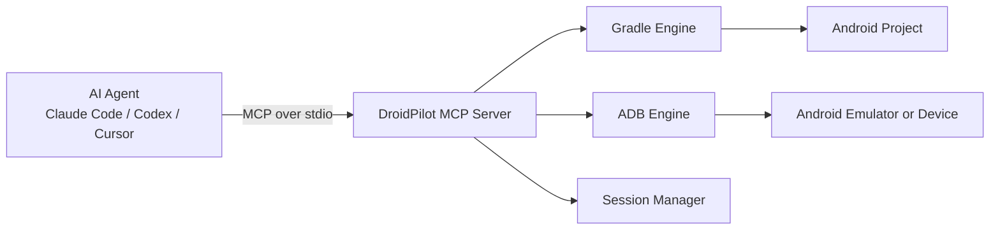

[Português (Brasil)](./README.pt-BR.md)

# DroidPilot

**Build-aware MCP server for Android app development agents.**

DroidPilot gives coding agents a practical local loop for native Android development: build the app, install it, launch it on an emulator or device, inspect the UI, interact with it, and read logs and runtime health back as structured JSON.

It is built for the workflow agents actually need:

`edit Kotlin / Compose code -> build -> install -> launch -> inspect UI -> interact -> verify -> iterate`

---

## Why DroidPilot

Most Android automation tools assume you already have a running app or a finished test suite. DroidPilot starts earlier in the cycle.

It is:

- **Build-aware**: understands Gradle projects, runs `assembleDebug`, parses build failures, and returns agent-friendly diagnostics.
- **Agent-first**: exposes a compact MCP tool surface that works well inside Claude Code, Codex, Cursor, and similar environments.
- **UI-capable**: captures accessibility snapshots, references elements as `@e1`, `@e2`, and so on, and can perform actions like `tap`, `fill`, `scroll`, and `back`.
- **Selector-aware**: lets agents target elements by `resourceId`, `text`, `contentDesc`, `hint`, and state flags instead of depending only on snapshot refs.
- **Local-dev focused**: optimized for the "I changed code, now prove the Android app still works" loop.

---

## Current Status

DroidPilot already supports the main local Android feedback loop:

- project detection
- device discovery
- build / install / launch
- accessibility snapshots
- basic UI interaction
- selector-based waits and assertions
- context-rich snapshots for textless clickable elements
- snapshot diffing between consecutive states
- deep link opening
- idle-aware and goal-oriented scrolling helpers
- screenshot capture
- per-session artifact capture
- screen video recording
- session-aware log collection
- app health checks with crash baselines
- environment diagnostics


Current scope:

- **transport**: stdio MCP
- **target**: local development
- **focus**: Android agents working against real projects

Known limitations:

- one active session per server instance
- UI quality depends on the app exposing useful accessibility metadata
- no HTTP transport yet

---

## What Agents Can Do

With DroidPilot, an agent can:

1. detect an Android project from its root folder
2. choose a ready emulator by default, or a specific `deviceSerial`
3. run a Gradle build
4. install and launch the app
5. inspect the current UI in a compact form
6. wait for elements and assert visible text or screen state
7. tap buttons and fill fields by ref, selector, or Compose test tag
8. use relational selectors such as `nearText` to disambiguate repeated buttons in lists
9. wait for the UI to become idle after a navigation or async load
10. scroll until a target appears, open deeplinks, and diff two consecutive snapshots
11. capture screenshots and videos into a per-session artifact folder
12. collect session-aware logs and runtime health information
13. iterate on code changes using the same local Android loop

---

## Architecture



### Main components

- **MCP server**
  Registers the tools used by the agent.

- **Gradle engine**
  Detects Android projects, resolves the Gradle wrapper, runs builds, parses failures, and discovers APK metadata.

- **ADB engine**
  Resolves `adb`, discovers devices, captures UI snapshots, launches apps, and performs interactions.

- **Session manager**
  Keeps the current project, device, package name, and latest snapshot across tool calls.

---

## Requirements

- Node.js 18+
- npm
- JDK installed
- Android SDK installed
- Android SDK Platform-Tools installed
- Android Build-Tools installed
- a running Android emulator or a connected Android device
- an Android project with:
  - `settings.gradle` or `settings.gradle.kts`
  - `gradlew` or `gradlew.bat`

Notes:

- On Windows, DroidPilot can automatically resolve `adb.exe` from common Android SDK locations.
- If more than one device is connected, DroidPilot can prefer an emulator or use an explicit `deviceSerial`.

---

## Installation

```bash
git clone https://github.com/your-org/droidpilot-mcp.git
cd droidpilot-mcp
npm install
npm run build
```

Run tests:

```bash
npm test
```

Run the server directly:

```bash
npm start
```

Run in development mode:

```bash
npm run dev
```

---

## MCP Client Integration

### Claude Code

Register DroidPilot as an MCP server:

```bash
claude mcp add droidpilot -- node /absolute/path/to/droidpilot-mcp/build/index.js
```

Windows example:

```powershell
claude mcp add droidpilot -- node "C:\Users\User\WebstormProjects\droidpilot-mcp\build\index.js"
```

After adding the server, restart or refresh the session if needed so the MCP list is reloaded.

### Claude Desktop

Example configuration:

```json
{
  "mcpServers": {
    "droidpilot": {
      "command": "node",
      "args": ["/absolute/path/to/droidpilot-mcp/build/index.js"]
    }
  }
}
```

### Cursor

Example `.cursor/mcp.json`:

```json
{
  "mcpServers": {
    "droidpilot": {
      "command": "node",
      "args": ["/absolute/path/to/droidpilot-mcp/build/index.js"]
    }
  }
}
```

### Other MCP clients

DroidPilot uses the standard MCP stdio transport, so any client that can spawn a local stdio MCP server can integrate with it.

---

## Quick Start With an Android Project

Once DroidPilot is registered in your MCP client, open your Android project and ask the agent to run a smoke test:

```text
Use the droidpilot MCP to test this Android project.

1. Call devices.
2. Call open with projectDir equal to the root of this Android project and preferEmulator true.
3. Call run.
4. Call snapshot with interactiveOnly true.
5. Tell me:
   - whether the app launched
   - which device was used
   - which screen/activity is open
   - and if anything failed, show summary, errors, and outputTail
```

If you want to force a specific emulator:

```text
Use the droidpilot MCP in this Android project.
Call open with projectDir equal to the project root and deviceSerial "emulator-5554".
Then call run and snapshot.
```

---

## Typical Agent Workflow

```text
1. open
2. run
3. snapshot
4. tap / fill / scroll / back
5. snapshot again
6. health + logs
7. edit code
8. run again
```

This is the intended local iteration loop:

- modify Android code
- rebuild and relaunch
- inspect the resulting UI
- perform a user action
- validate the next screen or state
- repeat

---

## MCP Tool Reference

### `devices`

Lists all connected Android devices and emulators, plus the default device DroidPilot would choose.

Typical output:

```json
{
  "adbPath": "C:\\Users\\User\\AppData\\Local\\Android\\Sdk\\platform-tools\\adb.exe",
  "defaultDeviceSerial": "emulator-5554",
  "devices": [
    {
      "serial": "emulator-5554",
      "type": "emulator",
      "model": "sdk gphone64 x86 64",
      "apiLevel": "36",
      "status": "device"
    }
  ]
}
```

### `open`

Starts a DroidPilot session by:

- validating the Android project
- selecting a device
- storing project and device state for later tool calls

Arguments:

- `projectDir: string`
- `deviceSerial?: string`
- `preferEmulator?: boolean`
- `artifactsDir?: string`

### `doctor`

Validates the local DroidPilot environment and optionally probes a real device snapshot.

Arguments:

- `projectDir?: string`
- `deviceSerial?: string`
- `preferEmulator?: boolean`
- `checkSnapshot?: boolean`

Returns:

- resolved `adb` path
- connected devices
- selected device or selection error
- optional project detection report
- optional lightweight snapshot probe

### `close`

Closes the current session and stops the app when possible.

### `build`

Runs a Gradle build for the attached Android project.

Arguments:

- `clean?: boolean`

Returns:

- build status
- build duration
- structured errors
- warning count
- summary
- output tail for debugging

### `run`

Runs the full build-install-launch sequence.

Arguments:

- `clean?: boolean`

Returns:

- launch status
- package name
- launch activity
- APK path
- build duration
- warnings
- summary

### `open_deeplink`

Opens a deeplink or web URI on the current device, optionally targeting the current app package, and can wait for the UI to settle.

Arguments:

- `uri: string`
- `packageName?: string`
- `waitForIdle?: boolean`
- `idleMs?: number`
- `timeoutMs?: number`
- `interactiveOnly?: boolean`

### `snapshot`

Captures the current UI hierarchy and returns compact references such as `@e1`, `@e2`, and so on.

Arguments:

- `interactiveOnly?: boolean` (default: `true`)

Returns:

- current screen/activity
- current package
- element count
- simplified element list with best-effort `label`, `parentText`, `childText`, `siblingText`, and `contextText`

Selectors supported across wait/assert/action tools:

- `ref`
- `resourceId` / `resourceIdContains`
- `testTag` / `testTagContains`
- `label` / `labelContains`
- `text` / `textContains`
- `contentDesc` / `contentDescContains`
- `hint` / `hintContains`
- `parentTextContains`
- `childTextContains`
- `siblingTextContains`
- `contextTextContains`
- `nearText` / `nearTextContains`
- `type`
- boolean flags such as `clickable`, `editable`, `enabled`, `selected`, `checked`

Relational note:

- `nearText` is a disambiguator, not a full selector by itself
- combine it with a target selector such as `clickable=true`, `textContains`, `resourceId`, or `type`

Compose note:

- `testTag` works best when the app exposes Compose semantics through `testTagsAsResourceId`
- DroidPilot normalizes the underlying `resource-id` into a friendly `testTag` field when possible

### `wait_for_element`

Polls the current UI until an element matching a selector appears or the timeout is reached.

Arguments:

- any selector field listed above
- `timeoutMs?: number`
- `intervalMs?: number`
- `interactiveOnly?: boolean`

### `assert_visible`

Asserts that at least one element matching a selector exists in the current UI.

Arguments:

- any selector field listed above
- `refresh?: boolean`
- `interactiveOnly?: boolean`

### `assert_text`

Asserts that a matched element exposes the expected `text`, `contentDesc`, or `hint`.

Arguments:

- any selector field listed above
- `expected: string`
- `source?: "text" | "contentDesc" | "hint"`
- `match?: "equals" | "contains"`
- `refresh?: boolean`
- `interactiveOnly?: boolean`

### `assert_screen`

Asserts the current screen/activity or package name after a navigation or launch.

Arguments:

- `screen?: string`
- `screenContains?: string`
- `package?: string`
- `packageContains?: string`
- `refresh?: boolean`

### `snapshot_diff`

Compares two consecutive snapshots so an agent can verify what changed after a tap, scroll, or back action.

Arguments:

- `refresh?: boolean`
- `interactiveOnly?: boolean`
- `maxItems?: number`

### `wait_for_idle`

Waits until the UI stops changing for a short quiet window.

Arguments:

- `timeoutMs?: number`
- `idleMs?: number`
- `pollIntervalMs?: number`
- `interactiveOnly?: boolean`
- `ignoreTextualChanges?: boolean`
- `maxChangedElements?: number`
- `maxAddedElements?: number`
- `maxRemovedElements?: number`

### `scroll_until`

Repeatedly scrolls in one direction until an element matching the selector appears or the limit is reached.

Arguments:

- any selector field listed above
- `direction: "up" | "down" | "left" | "right"`
- `maxScrolls?: number`
- `pauseMs?: number`
- `interactiveOnly?: boolean`

### `tap`

Taps an element from the latest snapshot or resolves the first match from a semantic selector.

Arguments:

- any selector field listed above
- `refresh?: boolean`
- `interactiveOnly?: boolean`

### `fill`

Focuses a text field, clears it, and types new text. Can target by ref or semantic selector.

Arguments:

- any selector field listed above
- `text: string`
- `refresh?: boolean`
- `interactiveOnly?: boolean`

### `scroll`

Scrolls the active screen.

Arguments:

- `direction: "up" | "down" | "left" | "right"`

Direction note:

- the value describes the content direction you want to reach
- for example, `down` means "show lower content in the list"

### `back`

Presses the Android Back button.

### `screenshot`

Captures a PNG screenshot from the current device. By default it lands in the current session artifact directory.

Arguments:

- `outputPath?: string`

### `artifacts`

Shows the current session artifact directory and the files already captured there.

### `record_video_start`

Starts device screen recording into the current session artifact directory.

Arguments:

- `outputPath?: string`
- `bitRateMbps?: number`
- `timeLimitSec?: number`

### `record_video_stop`

Stops the active screen recording and pulls the MP4 locally.

### `logs`

Returns recent app logs using a session or launch baseline, filtered by the current or last known app PID when possible.

Arguments:

- `maxLines?: number`
- `scope?: "session" | "launch"`

### `health`

Returns app runtime signals:

- whether the app is running
- PID
- memory usage
- crash indicators since this session
- crash indicators since the latest launch when available

---

## Example Outputs

### `open`

```json
{
  "status": "ok",
  "session": "s1775879638637",
  "project": {
    "dir": "C:\\Users\\User\\AndroidStudioProjects\\MyApp",
    "module": "app",
    "applicationId": "com.example.myapp",
    "buildVariant": "debug"
  },
  "device": {
    "serial": "emulator-5554",
    "type": "emulator",
    "model": "sdk gphone64 x86 64",
    "apiLevel": "36",
    "status": "device"
  }
}
```

### `run`

```json
{
  "status": "running",
  "package": "com.example.myapp",
  "activity": "com.example.myapp/.MainActivity",
  "apkPath": "C:\\path\\to\\app-debug.apk",
  "buildDurationMs": 19876,
  "incremental": true,
  "warningsCount": 0,
  "summary": "Build completed successfully."
}
```

### `snapshot`

```json
{
  "status": "ok",
  "screen": "com.example.myapp/.MainActivity",
  "package": "com.example.myapp",
  "elementCount": 4,
  "elements": [
    {
      "ref": "@e1",
      "type": "Button",
      "text": "Continue",
      "clickable": true,
      "focusable": true,
      "scrollable": false,
      "editable": false,
      "enabled": true
    }
  ]
}
```

### `wait_for_element`

```json
{
  "status": "ok",
  "queryDescription": "textContains=\"Profile\", clickable=true",
  "waitedMs": 412,
  "screen": "com.example.myapp/.MainActivity",
  "package": "com.example.myapp",
  "matchCount": 1,
  "firstMatch": {
    "ref": "@e8",
    "type": "NavigationBarItemView",
    "text": "Profile",
    "description": "@e8 NavigationBarItemView text=\"Profile\""
  }
}
```

### `snapshot_diff`

```json
{
  "status": "changed",
  "screenChanged": true,
  "addedCount": 2,
  "removedCount": 1,
  "changedCount": 1,
  "summary": "screen changed from com.example.myapp/.HomeActivity to com.example.myapp/.ProfileActivity; 2 element(s) added; 1 element(s) removed; 1 element(s) changed"
}
```

### `wait_for_idle`

```json
{
  "status": "ok",
  "waitedMs": 1054,
  "stableForMs": 941,
  "screen": "com.example.myapp/.ProfileActivity",
  "package": "com.example.myapp"
}
```

---

## Example Agent Prompts

### Smoke test a project

```text
Use the droidpilot MCP to test this Android project.

1. Call devices.
2. Call open with projectDir equal to the root of this project and preferEmulator true.
3. Call run.
4. Call snapshot with interactiveOnly true.
5. Tell me if the app launched successfully, which device was used, and which screen/activity is open.
```

### Verify a UI navigation flow

```text
Use the droidpilot MCP in this Android project.

1. Call open with projectDir equal to the project root and deviceSerial "emulator-5554".
2. Call snapshot with interactiveOnly true.
3. Tap the profile tab in the bottom navigation.
4. Call snapshot again and compare the screen/activity.
5. Run health and logs.
6. Tell me whether the navigation worked and whether there are crashes or relevant errors.
```

### Run an edit-verify loop

```text
Use the droidpilot MCP as part of your Android edit loop.

Whenever you change code:
1. Call run.
2. If build fails, inspect summary, errors, and outputTail and fix the code.
3. If build succeeds, call snapshot.
4. Interact with the new UI if needed.
5. Use health and logs to validate the result before making the next change.
```

---

## Reliability Notes

DroidPilot is designed to be resilient in the places that matter most during local Android development:

- resolves `adb` automatically instead of assuming it is on `PATH`
- prefers an emulator when both a phone and an emulator are connected
- still supports explicit `deviceSerial` when deterministic selection is needed
- supports `gradlew.bat` on Windows
- parses common build failure patterns into structured diagnostics
- uses a real XML parser for UI snapshots
- enriches snapshots with sibling/parent/child text context so textless controls are easier to identify
- supports semantic selectors for waits, assertions, and UI actions
- supports relational disambiguation with `nearText`
- supports explicit Compose `testTag` selectors when they are exposed through accessibility / resource IDs
- tracks log/crash baselines per session and per launch
- tolerates text-only churn in `wait_for_idle` by default
- stores snapshots, diffs, screenshots, and videos per session in a predictable artifact folder
- attempts to resolve the launchable activity instead of assuming `.MainActivity`

That said, DroidPilot still depends on the realities of Android automation:

- UI automation quality is limited by the app's accessibility tree
- some apps and screens expose sparse or poor accessibility metadata
- custom views without accessibility labels are harder for any agent to use reliably

---

## Troubleshooting

### `ADB_NOT_FOUND`

Meaning:

- DroidPilot could not resolve `adb`

What to check:

- Android SDK is installed
- Platform-Tools are installed
- `ANDROID_SDK_ROOT` or `ANDROID_HOME` is set if auto-discovery is not enough

### `PROJECT_NOT_FOUND`

Meaning:

- `projectDir` does not look like an Android project root

What to check:

- the folder contains `settings.gradle` or `settings.gradle.kts`
- the folder contains `gradlew` or `gradlew.bat`

### `build_failed`

Meaning:

- Gradle failed or the APK could not be produced

What to inspect:

- `summary`
- `errors`
- `outputTail`

### `launch_failed`

Meaning:

- the app was built and installed, but DroidPilot could not start it

What to inspect:

- package name
- launch activity
- logs
- whether the APK manifest exposes a launchable activity

### `snapshot` returns too little information

Meaning:

- the current screen may expose limited accessibility metadata

What to try:

- run `snapshot` with `interactiveOnly: false`
- use `screenshot`
- verify accessibility labels in the app itself

### Wrong device was selected

Use an explicit serial:

```text
Call open with projectDir equal to the project root and deviceSerial "emulator-5554".
```

---

## Development

### Scripts

```bash
npm run build
npm run dev
npm run start
npm test
```

### Project structure

```text
src/
  index.ts              MCP server and tool registration
  engines/
    adb.ts              Device discovery, UI inspection, interaction, logs
    artifacts.ts        Session artifact paths and JSON persistence
    gradle.ts           Project detection, build execution, APK discovery
    selectors.ts        Semantic selector matching for waits, assertions, and actions
    snapshot-diff.ts    UI diffing between consecutive snapshots
    session.ts          Active session state

build/
  Compiled JavaScript output

test/
  adb-utils.test.mjs    Log parsing and Compose test tag helper tests
  artifacts.test.mjs    Artifact path and persistence tests
  gradle.test.mjs       Build engine smoke and regression tests
  selectors.test.mjs    Selector matching regression tests
  snapshot-diff.test.mjs Snapshot diff regression tests
```

### Suggested local validation

When working on DroidPilot itself, a useful validation sequence is:

1. `npm test`
2. start or verify an emulator is running
3. connect DroidPilot to an MCP client
4. run:
   - `devices`
   - `open`
   - `snapshot`
   - `wait_for_idle`
5. then test a real Android app with:
   - `run`
   - `open_deeplink`
   - `snapshot`
   - `scroll_until`
   - `snapshot_diff`
   - `tap`
   - `artifacts`
   - `health`
   - `logs`

---

## Roadmap

- reusable capture flows / scriptable screen packs
- richer Compose semantics and selector support beyond `testTagsAsResourceId`
- HTTP transport / daemon mode
- CI integration
- richer artifact capture and export bundles
- multi-session support

---

## License

MIT
