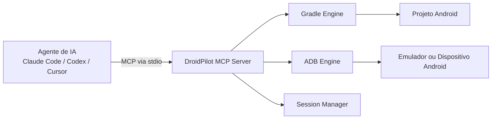

[English](./README.md)

# DroidPilot

**Servidor MCP com consciência de build para agentes de desenvolvimento Android.**

O DroidPilot dá aos agentes de código um loop local prático para desenvolvimento Android nativo: compilar o app, instalar, abrir em emulador ou dispositivo, inspecionar a UI, interagir com ela e ler logs e sinais de saúde em JSON estruturado.

Ele foi pensado para o fluxo que agentes realmente precisam:

`editar código Kotlin / Compose -> build -> instalar -> abrir -> inspecionar UI -> interagir -> validar -> iterar`

---

## Por que DroidPilot

A maioria das ferramentas de automação Android assume que você já tem um app rodando ou uma suíte de testes pronta. O DroidPilot entra antes disso, no ciclo de desenvolvimento.

Ele é:

- **Build-aware**: entende projetos Gradle, roda `assembleDebug`, interpreta falhas de build e devolve diagnósticos úteis para agentes.
- **Agent-first**: expõe uma superfície MCP enxuta e amigável para Claude Code, Codex, Cursor e ambientes semelhantes.
- **Capaz de operar UI**: captura snapshots de acessibilidade, referencia elementos como `@e1`, `@e2` e consegue executar ações como `tap`, `fill`, `scroll` e `back`.
- **Focado em dev local**: otimizado para o fluxo "mudei o código, agora prove que o app Android ainda funciona".

---

## Estado atual

O DroidPilot já cobre o loop principal de feedback local para agentes Android:

- detecção de projeto
- descoberta de devices
- build / install / launch
- snapshots de acessibilidade
- interações básicas de UI
- captura de screenshot
- coleta de logs
- health checks do app


Escopo atual:

- **transporte**: MCP via stdio
- **alvo**: desenvolvimento local
- **foco**: agentes operando em projetos Android reais

Limitações conhecidas:

- uma sessão ativa por instância do servidor
- a qualidade da automação depende da qualidade da árvore de acessibilidade do app
- ainda não há transporte HTTP
- ainda não há tools de assertion nem diff de snapshots

---

## O que um agente pode fazer

Com o DroidPilot, um agente pode:

1. detectar um projeto Android a partir da raiz
2. escolher um emulador pronto por padrão, ou um `deviceSerial` específico
3. rodar build com Gradle
4. instalar e abrir o app
5. inspecionar a UI atual em formato compacto
6. tocar botões, preencher campos, rolar listas e voltar
7. capturar screenshots
8. coletar logs e sinais de saúde do app
9. iterar sobre mudanças de código usando o mesmo loop local Android

---

## Arquitetura



### Componentes principais

- **Servidor MCP**
  Registra as tools usadas pelo agente.

- **Gradle engine**
  Detecta projetos Android, resolve o wrapper do Gradle, roda builds, interpreta falhas e descobre metadados do APK.

- **ADB engine**
  Resolve `adb`, descobre devices, captura snapshots de UI, abre apps e executa interações.

- **Session manager**
  Mantém projeto, device, package name e último snapshot entre chamadas de tools.

---

## Requisitos

- Node.js 18+
- npm
- JDK instalado
- Android SDK instalado
- Android SDK Platform-Tools instalado
- Android Build-Tools instalado
- um emulador Android rodando ou um dispositivo Android conectado
- um projeto Android com:
  - `settings.gradle` ou `settings.gradle.kts`
  - `gradlew` ou `gradlew.bat`

Observações:

- No Windows, o DroidPilot consegue resolver `adb.exe` automaticamente em locais comuns do Android SDK.
- Se houver mais de um device conectado, o DroidPilot pode preferir um emulador ou usar um `deviceSerial` explícito.

---

## Instalação

```bash
git clone https://github.com/sua-org/droidpilot-mcp.git
cd droidpilot-mcp
npm install
npm run build
```

Rodar os testes:

```bash
npm test
```

Rodar o servidor diretamente:

```bash
npm start
```

Rodar em modo desenvolvimento:

```bash
npm run dev
```

---

## Integração com clientes MCP

### Claude Code

Registre o DroidPilot como servidor MCP:

```bash
claude mcp add droidpilot -- node /caminho/absoluto/para/droidpilot-mcp/build/index.js
```

Exemplo no Windows:

```powershell
claude mcp add droidpilot -- node "C:\Users\User\WebstormProjects\droidpilot-mcp\build\index.js"
```

Depois de adicionar o servidor, reinicie ou atualize a sessão se necessário para recarregar a lista de MCPs.

### Claude Desktop

Exemplo de configuração:

```json
{
  "mcpServers": {
    "droidpilot": {
      "command": "node",
      "args": ["/caminho/absoluto/para/droidpilot-mcp/build/index.js"]
    }
  }
}
```

### Cursor

Exemplo de `.cursor/mcp.json`:

```json
{
  "mcpServers": {
    "droidpilot": {
      "command": "node",
      "args": ["/caminho/absoluto/para/droidpilot-mcp/build/index.js"]
    }
  }
}
```

### Outros clientes MCP

O DroidPilot usa transporte MCP padrão via stdio, então qualquer cliente capaz de abrir um servidor MCP local via stdio pode integrá-lo.

---

## Quick Start com um projeto Android

Depois de registrar o DroidPilot no seu cliente MCP, abra o projeto Android e peça ao agente para fazer um smoke test:

```text
Use o MCP droidpilot para testar este projeto Android.

1. Chame devices.
2. Chame open com projectDir igual à raiz deste projeto Android e preferEmulator true.
3. Chame run.
4. Chame snapshot com interactiveOnly true.
5. Me diga:
   - se o app abriu
   - qual device foi usado
   - qual screen/activity está aberta
   - e, se algo falhar, mostre summary, errors e outputTail
```

Se você quiser forçar um emulador específico:

```text
Use o MCP droidpilot neste projeto Android.
Chame open com projectDir igual à raiz do projeto e deviceSerial "emulator-5554".
Depois chame run e snapshot.
```

---

## Fluxo típico de um agente

```text
1. open
2. run
3. snapshot
4. tap / fill / scroll / back
5. snapshot de novo
6. health + logs
7. editar código
8. run novamente
```

Esse é o loop local pretendido:

- modificar código Android
- recompilar e relançar
- inspecionar a UI resultante
- executar uma ação de usuário
- validar a próxima tela ou estado
- repetir

---

## Referência das tools MCP

### `devices`

Lista todos os devices e emuladores conectados, além do device padrão que o DroidPilot escolheria.

Exemplo de saída:

```json
{
  "adbPath": "C:\\Users\\User\\AppData\\Local\\Android\\Sdk\\platform-tools\\adb.exe",
  "defaultDeviceSerial": "emulator-5554",
  "devices": [
    {
      "serial": "emulator-5554",
      "type": "emulator",
      "model": "sdk gphone64 x86 64",
      "apiLevel": "36",
      "status": "device"
    }
  ]
}
```

### `open`

Inicia uma sessão DroidPilot:

- valida o projeto Android
- seleciona um device
- guarda estado de projeto e device para as próximas chamadas

Argumentos:

- `projectDir: string`
- `deviceSerial?: string`
- `preferEmulator?: boolean`

### `close`

Encerra a sessão atual e tenta parar o app quando possível.

### `build`

Roda build Gradle para o projeto Android anexado.

Argumentos:

- `clean?: boolean`

Retorna:

- status do build
- duração
- erros estruturados
- quantidade de warnings
- summary
- output tail para debug

### `run`

Executa o fluxo completo de build, install e launch.

Argumentos:

- `clean?: boolean`

Retorna:

- status de launch
- package name
- launch activity
- caminho do APK
- duração do build
- warnings
- summary

### `snapshot`

Captura a hierarquia de UI atual e devolve referências compactas como `@e1`, `@e2` e assim por diante.

Argumentos:

- `interactiveOnly?: boolean` (padrão: `true`)

Retorna:

- screen/activity atual
- package atual
- número de elementos
- lista simplificada de elementos

### `tap`

Toca em um elemento do último snapshot.

Argumentos:

- `ref: string`

### `fill`

Foca um campo de texto, limpa o valor atual e digita um novo texto.

Argumentos:

- `ref: string`
- `text: string`

### `scroll`

Rola a tela ativa.

Argumentos:

- `direction: "up" | "down" | "left" | "right"`

### `back`

Pressiona o botão voltar do Android.

### `screenshot`

Captura uma screenshot PNG do device atual.

Argumentos:

- `outputPath?: string`

### `logs`

Retorna logs recentes do app, filtrados pelo PID quando possível.

Argumentos:

- `maxLines?: number`

### `health`

Retorna sinais de runtime do app:

- se o app está rodando
- PID
- uso de memória
- indicadores recentes de crash nos logs

---

## Exemplos de saída

### `open`

```json
{
  "status": "ok",
  "session": "s1775879638637",
  "project": {
    "dir": "C:\\Users\\User\\AndroidStudioProjects\\MeuApp",
    "module": "app",
    "applicationId": "com.example.meuapp",
    "buildVariant": "debug"
  },
  "device": {
    "serial": "emulator-5554",
    "type": "emulator",
    "model": "sdk gphone64 x86 64",
    "apiLevel": "36",
    "status": "device"
  }
}
```

### `run`

```json
{
  "status": "running",
  "package": "com.example.meuapp",
  "activity": "com.example.meuapp/.MainActivity",
  "apkPath": "C:\\caminho\\para\\app-debug.apk",
  "buildDurationMs": 19876,
  "incremental": true,
  "warningsCount": 0,
  "summary": "Build completed successfully."
}
```

### `snapshot`

```json
{
  "status": "ok",
  "screen": "com.example.meuapp/.MainActivity",
  "package": "com.example.meuapp",
  "elementCount": 4,
  "elements": [
    {
      "ref": "@e1",
      "type": "Button",
      "text": "Continuar",
      "clickable": true,
      "focusable": true,
      "scrollable": false,
      "editable": false,
      "enabled": true
    }
  ]
}
```

---

## Exemplos de prompts para agentes

### Smoke test de um projeto

```text
Use o MCP droidpilot para testar este projeto Android.

1. Chame devices.
2. Chame open com projectDir igual à raiz deste projeto e preferEmulator true.
3. Chame run.
4. Chame snapshot com interactiveOnly true.
5. Me diga se o app abriu com sucesso, qual device foi usado e qual screen/activity está aberta.
```

### Validar um fluxo de navegação

```text
Use o MCP droidpilot neste projeto Android.

1. Chame open com projectDir igual à raiz do projeto e deviceSerial "emulator-5554".
2. Chame snapshot com interactiveOnly true.
3. Toque na aba de perfil da bottom navigation.
4. Chame snapshot novamente e compare a screen/activity.
5. Rode health e logs.
6. Me diga se a navegação funcionou e se há crashes ou erros relevantes.
```

### Rodar um loop de editar e validar

```text
Use o MCP droidpilot como parte do seu loop de edição Android.

Sempre que mudar código:
1. Chame run.
2. Se o build falhar, inspecione summary, errors e outputTail e corrija o código.
3. Se o build passar, chame snapshot.
4. Interaja com a nova UI se necessário.
5. Use health e logs para validar o resultado antes da próxima mudança.
```

---

## Notas de confiabilidade

O DroidPilot foi desenhado para ser resiliente nos pontos mais importantes do desenvolvimento Android local:

- resolve `adb` automaticamente em vez de assumir que ele está no `PATH`
- prefere emulador quando há celular e emulador conectados ao mesmo tempo
- ainda suporta `deviceSerial` explícito quando seleção determinística é importante
- suporta `gradlew.bat` no Windows
- interpreta padrões comuns de falha de build e devolve diagnósticos estruturados
- usa parser XML real para snapshots de UI
- tenta resolver a launchable activity em vez de assumir `.MainActivity`

Ainda assim, o DroidPilot continua dependente das limitações naturais da automação Android:

- a qualidade da automação depende da árvore de acessibilidade do app
- alguns apps e telas expõem metadados de acessibilidade pobres
- custom views sem labels de acessibilidade são mais difíceis para qualquer agente usar bem

---

## Troubleshooting

### `ADB_NOT_FOUND`

Significa:

- o DroidPilot não conseguiu resolver o `adb`

O que verificar:

- Android SDK instalado
- Platform-Tools instalado
- `ANDROID_SDK_ROOT` ou `ANDROID_HOME` configurado se a autodetecção não bastar

### `PROJECT_NOT_FOUND`

Significa:

- o `projectDir` não parece ser a raiz de um projeto Android

O que verificar:

- a pasta contém `settings.gradle` ou `settings.gradle.kts`
- a pasta contém `gradlew` ou `gradlew.bat`

### `build_failed`

Significa:

- o Gradle falhou ou o APK não pôde ser produzido

O que inspecionar:

- `summary`
- `errors`
- `outputTail`

### `launch_failed`

Significa:

- o app foi compilado e instalado, mas o DroidPilot não conseguiu abri-lo

O que inspecionar:

- package name
- launch activity
- logs
- se o manifesto do APK expõe uma launchable activity

### `snapshot` trouxe pouca informação

Significa:

- a tela atual pode estar expondo poucos metadados de acessibilidade

O que tentar:

- rodar `snapshot` com `interactiveOnly: false`
- usar `screenshot`
- verificar labels e acessibilidade no próprio app

### O device selecionado foi o errado

Use um serial explícito:

```text
Chame open com projectDir igual à raiz do projeto e deviceSerial "emulator-5554".
```

---

## Desenvolvimento

### Scripts

```bash
npm run build
npm run dev
npm run start
npm test
```

### Estrutura do projeto

```text
src/
  index.ts              servidor MCP e registro das tools
  engines/
    adb.ts              descoberta de device, inspeção de UI, interação e logs
    gradle.ts           detecção de projeto, build e descoberta de APK
    session.ts          estado da sessão ativa

build/
  saída JavaScript compilada

test/
  gradle.test.mjs       testes de regressão do build engine
```

### Sequência sugerida de validação local

Ao trabalhar no DroidPilot em si, uma boa sequência de validação é:

1. `npm test`
2. iniciar ou verificar um emulador rodando
3. conectar o DroidPilot a um cliente MCP
4. rodar:
   - `devices`
   - `open`
   - `snapshot`
5. depois validar um app Android real com:
   - `run`
   - `snapshot`
   - `tap`
   - `health`
   - `logs`

---

## Roadmap

- diff de snapshots
- tools de assertion
- gravação e replay de fluxos
- seletores melhores para apps muito baseados em Compose
- transporte HTTP / daemon mode
- integração com CI
- captura de artefatos mais rica
- suporte a múltiplas sessões

---

## Licença

MIT
